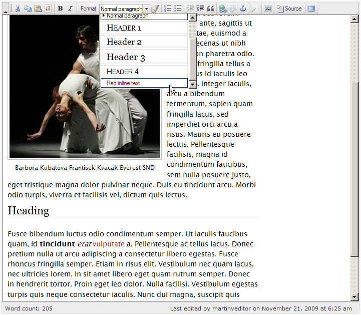

!SLIDE center
# A Counterexample

## Blogging With Wordpress

(No offence!) 

!SLIDE vaderbg

# 1) Your lack of efficiency disturbs me

* for most resources
  * run php
  * open the php files
  * parse and execute them
  * connect to db
  * stream to apache

!SLIDE
# 2) Code Sucks For This

* Slower than it needs to be
* might be buggy or insecure
* Have to upgrade/backup/maintain

!SLIDE
# 3) Scaling & HA Is Work

!SLIDE center
## GUI Editor || ugly hack

!SLIDE
# Extending Means PHP

## I don't care if I am bad at PHP

!SLIDE
# SKILLS LIST

* Writing/Explaining
* ...

!SLIDE
# The Ideal System

* Static (Fast and Safe)
* Develops More Skills

!SLIDE
# Skills Wish List

* Favorite Editor
* Version Controlled (git)
* Web-friendly markup language
* Programming Language we use
