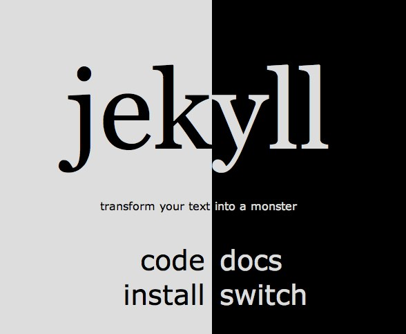
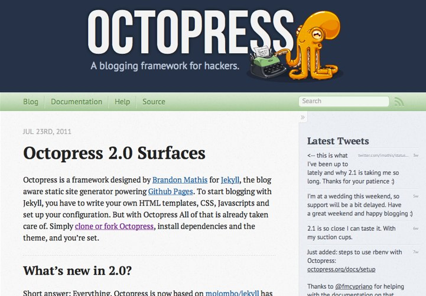
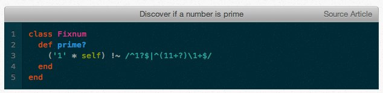

!SLIDE center
# Meet Octopress


!SLIDE center
# Short History

* github => jekyll for pages
  * very 'by hand' static generator
  * took me ~1 week to get functional


!SLIDE center
## Octopress = Jekyll that "just works"


!SLIDE
# The Goodies

* Mobile Friendly HTML5 Template
* Twitter, +1, Disqus, Google Analytics, ...
* Deploy => (github || rsync)
* Easy theming with Compass and Sass
* Solarized syntax highlighting

!SLIDE
# Show Me!
* Set up environment (rvm)
* Install octopress
* _Import Former Blog_
* Write Post
* Publish

!SLIDE commandline

# RVM 

    $ bash < <(curl -s 
        https://rvm.beginrescueend.com/install/rvm)

    $ echo '[[ -s "$HOME/.rvm/scripts/rvm" ]] && 
      .  "$HOME/.rvm/scripts/rvm" >> ~/.bash_profile
    $ source ~/.bash_profile

    $ rvm install 1.9.2 && rvm use 1.9.2
    $ rvm rubygems latest

!SLIDE commandline

# Set up Octopress

    $ git clone git://github.com/imathis/octopress.git octopress
    $ cd octopress 
    $ ruby --version  # Should report Ruby 1.9.2
## install dependencies

    $ gem install bundler
    $ bundle install

## Set up the default theme

    $ rake install 

!SLIDE commandline

# get it in version control!
## make yourself a github repo, then...

    $ git remote rename origin octopress
    $ git remote add origin (your URL)
    # set your new origin as the default branch
    $ git config branch.master.remote origin


!SLIDE smaller code

# Configure it: _config.yml

    @@@yaml
    url: http://serialized.net
    title: serialized.net
    subtitle: A study in fascination burnout
    author: Joshua Barratt
    permalink: /:year/:month/:title/
    paginate: 3 # Posts per page on the blog index

    # Github repositories
    github_user: jbarratt

    # Twitter
    twitter_user: jbarratt
    twitter_tweet_count: 4

!SLIDE smaller code

# Configure it: Rakefile

    @@@ruby
    ## -- Rsync Deploy config -- ##

    # Be sure your public key is listed in your 
    # server's ~/.ssh/authorized_keys file

    ssh_user       = "serialized.net@serialized.net"
    ssh_port       = "22"
    document_root  = "~/domains/serialized.net/html/"
    deploy_default = "rsync"

!SLIDE

# Finish it up!
## (Out of scope, great docs)

* Customize (Themeing, etc)
* Migrate Content
* (Later, upgrade)

!SLIDE smaller

# Actually blogging
    
    @@@ shell
    $ rake new_post["Hello Octopress!"] 
      # (escape \[, \] in zsh)
    # creates
    # source/_posts/YYYY-MM-DD-hello-octopress.markdown
## Post Header

    @@@ Ruby
    ---
    layout: post
    title: "Hello Octopress!"
    date: YYYY-MM-DD HH:MM
    comments: true
    categories:
    ---

!SLIDE smaller

# Sharing Code is Easy: Github ```

    ``` ruby Discover ... is prime http://.../ Source Article
    class Fixnum
      def prime?
        ('1' * self) !~ /^1?$|^(11+?)\1+$/
      end
    end
    ```


!SLIDE kittehslide
<script>
$(".kittehslide").bind("showoff:show", function (event) {
  $('.kittehslide').css("margin-top", "20px");
});
</script>

    @@@ shell
    
    
    
    


!SLIDE smaller 

# Gorgeous quotes

    
    Quote string
    

    
    Every interaction is both precious and an opportunity to delight.
    


!SLIDE commandline

# SHIP IT

    $ rake generate
    $ rake preview
    # make sure it looks good, http://localhost:4000
    $ git add source/_posts/YYYY-MM-DD-hello-octopress.markdown
    $ git commit -m "my first post. Move over, Dickens."
    $ rake deploy
    $ git push origin master

!SLIDE commandline

# New pages, basically the same

    $ rake new_page[super-awesome]
    # creates /source/super-awesome/index.markdown

    $ rake new_page[super-awesome/page.html]
    # creates /source/super-awesome/page.html


!SLIDE smaller
# .htaccess trick

1. Steal a great .htaccess from HTML5 Boilerplate
2. Test it safely

## Example

    @@@ ruby
    # document_root  = "~/domains/serialized.net/html/"
    document_root  = "~/domains/stage.serialized.net/html/"

!SLIDE small

# Helpful .htaccess toys

    # Set up pretty error document pages
    ErrorDocument 404 /404.html
    ErrorDocument 403 /403.html

    RewriteEngine On
    RewriteRule ^(feed|atom)/ /atom.xml [R=301]
    RewriteRule ^feed$ /atom.xml [R=301]
    RewriteRule ^index.rdf /atom.xml [R=301]
